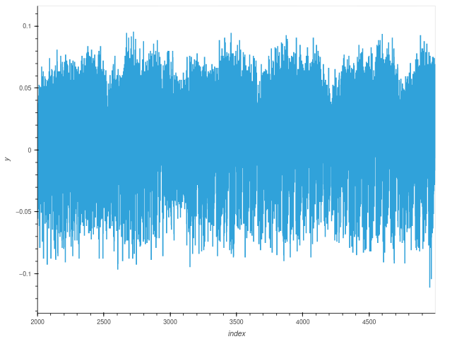

# EM Trace Collection

This repos include instruction and sripts for collecting EM trace with different devices. such as wtih device CW505 H-Field probe, and wtih device osilloscope ps3206D to collect EM trace.


How to collect EM trace, please see the details in the corresponding sub-folder.


## Instruction for collecting EM trace with CW505 H-Field planar probe

Before using H-Field probe to collect EM trace, you should install ChipWhisperer driver. The instruction of how to install it can be find in the following link: https://chipwhisperer.readthedocs.io/en/latest/installing.html#install 

After you install all requirements in the above link, you can use the sripts we provided to collect EM trace. 

```probe_position_exploration_em_trace.ipynb``` is to decide the best postion for probe placed with the real-time visualization of EM trace. You can find the running steps and instructions inside the notebook.

### AES Encryption Pattern
The following figure is the AES encryption pattern, when you see a pattern looks like the pattern in the figure, you should fixed the position of probe. You can start collecting your EM trace of AES encryption.



```em_trace_autoCapture.ipynb``` once the best postion is found, we can automatically collect em trace and save it to npz file. You can find the running steps and instructions inside the notebook.


## Collect EM trace with osilloscope ps3000a (e.g., ps3206D)

In order to use ps3000a to collect data with this script, the driver of ps3000a has to be installed first. How to install driver can be find in following link: https://www.picotech.com/downloads/linux

Note that, the device we use is ps3206D, the corresonding driver should locate in the category 'PicoScope 3200 & 3400 A/B/D & MSO devices'.

Currently, we can automatically sample data with this osilloscope, but the tradeoff here is that it's relativelly time-consuming. For example, it takes 6 seconds for one trace (5000 length). The reason why it is slow, it's because we need to reset it each time once a trace is sampled. 

We still working on a faster sampling approach...
